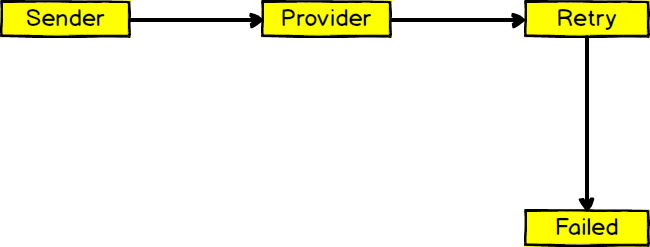

<p align="center">
  
</p>


# Overview

Simple Apache Kafka queue demonstration with retry option. Every Kafka message contains subscription data for an email campaign.
The provider consumer will try to add the subscription to the campaign. If this fails then the message will handover to retry
consumer with failing reason and timestamp. If the retry consumer fails then it will go to the failed queue,
and this needs to be handled manually.

## Pre-requisites

* Install kafka from official [guide](https://kafka.apache.org/quickstart) or you can follow this [guide](./kafka-installation-guide.md)
* Nodejs > 8.5.0, should run on any version of node 8.

## Step 1: Start the server

Start a ZooKeeper server. Kafka has a single node Zookeeper configuration built-in.
```
$ bin/zookeeper-server-start.sh config/zookeeper.properties &
```
Now start Kafka itself:
```
$ bin/kafka-server-start.sh config/server.properties &
```

## Step 2: Create topics
```
$ bin/kafka-topics.sh --create --zookeeper localhost:2181 --replication-factor 1 --partitions 4 --topic provider
$ bin/kafka-topics.sh --create --zookeeper localhost:2181 --replication-factor 1 --partitions 2 --topic provider-retry
$ bin/kafka-topics.sh --create --zookeeper localhost:2181 --replication-factor 1 --partitions 2 --topic provider-failed
```
These can be easily listed
```
$ bin/kafka-topics.sh --list --zookeeper localhost:2181
provider
provider-retry
provider-failed
```
Note: In production disable topics auto creation `auto.create.topics.enable=false`

## Step 3: Install package from npm
```
$ npm i
```

## Step 4: Setup environment variables

Copy .env.example to .env. Create a dummy campaign list at [klaviyo](https://klaviyo.com) and replace .env configuration with your credentials.

## Step 5: Start consumers

```
$ node src/provider.js
$ node src/providerRetry.js
```

Alternative way with pm2

```
$ pm2 start pm2.json
```

## Step 6: Send data to producer

```
$ node test/sendTestData.js
Sent msg number 0
...
Sent msg number 1000
```

## Remote listener binding

Hostname and port the broker will advertise to producers and consumers. If not set,
it uses the value for "listeners" if configured.  Otherwise, it will use the value
returned from java.net.InetAddress.getCanonicalHostName().
```
#advertised.listeners=PLAINTEXT://your.host.name:9092
```

## Useful commands

Describe a topic:
```
bin/kafka-topics.sh --describe --zookeeper localhost:2181 --topic provider
```

Increase topic partitions:
```
bin/kafka-topics.sh --zookeeper localhost:2181 --alter --topic provider --partitions 4
```

## Cleaning Up
Stop Kafka and Zookeeper and delete the log directories

```
$ project-dir
bin/kafka-server-start.sh config/server.properties
^C
$ kill -9 [PID]
```

```
$ project-dir
bin/zookeeper-server-start.sh config/zookeeper.properties
^C
$ kill -9 [PID]
```

```
$ rm -rf /tmp/zookeeper/version-2/log.* && rm -rf /tmp/kafka-logs/
```

Note: find process id number with `ps aux | grep zookeeper.properties`

## Author

**Joynal Abedin** - [Joynal](https://twitter.com/joynaluu)

## License

This project is licensed under the MIT License - see the [LICENSE.md](./LICENSE.md) file for details