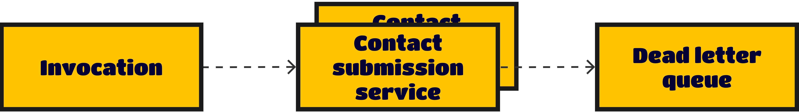

<p align="center">
  
</p>

# Overview

This is a straightforward demonstration of an Apache Kafka with NodeJS, featuring a dead letter queue functionality.
Each message in the Kafka queue contains subscription data for an email campaign. The contact submission consumer's main
task is to attempt the submission of the subscription data to a campaign API. In the event of a failure during this
process, the message will be forwarded to the dead letter queue. Here, it will be accompanied by a reason for the
failure and a timestamp, providing valuable information about the unsuccessful attempt.

### Pre-requisites

* Docker or you can setup kafka on your own
* Nodejs >= 18.12.0.

### Step 1: Bootstrap kafka

The provided docker compose file offers a easy quick setup for Kafka.

```
docker-compose up -d
```

### Step 2: Create topics

To utilize the following commands, please download Kafka from official website to your local machine and navigate to
the `bin` directory.

```
./kafka-topics.sh --create --bootstrap-server 127.0.0.1:9094 --replication-factor 1 --partitions 4 --topic contact-submission-queue
./kafka-topics.sh --create --bootstrap-server 127.0.0.1:9094 --replication-factor 1 --partitions 2 --topic dead-letter-queue
```

Created topics can be easily listed by running following command.

```
./kafka-topics.sh --list --bootstrap-server 127.0.0.1:9094
```

Output should be something like:

```
contact-submission-queue
dead-letter-queue
```

### Step 3: Install packages from npm

```
$ npm i
```

### Step 4: Setup environment variables

Copy `.env.example` to `.env`. Create a dummy campaign list at [klaviyo](https://klaviyo.com) and replace `.env`
configuration with your credentials.

### Step 5: Start consumers

The contact submission service is designed to retrieve messages from the `contact-submission-queue` and attempt to submit
contact data to a third-party API. Contact submission service will join into a Kafka consumer group, you can deploy multiple
instances of this service in various locations, enabling parallel processing of messages.

```
node src/contactSubmission.js
```

In the event of a failed contact submission due to an API error, the data will be moved to a dead letter, allowing for
later analysis and investigation.

```
node src/deadLetter.js
```

### Step 6: Send data to producer

```
node src/sendTestData.js
send to >>> contact-submission-queue - 1
...
send to >>> contact-submission-queue - 3
```

#### Useful commands

Describe a topic:

```
bin/kafka-topics.sh --describe --bootstrap-server 127.0.0.1:9094 --topic provider
```

Increase topic partitions:

```
bin/kafka-topics.sh --bootstrap-server 127.0.0.1:9094 --alter --topic provider --partitions 4
```

### Author

**Joynal Abedin** - [Joynal](https://linkedin.com/in/joynaluu/)

### License

This project is licensed under the MIT License - see the [license.md](./license.md) file for details
